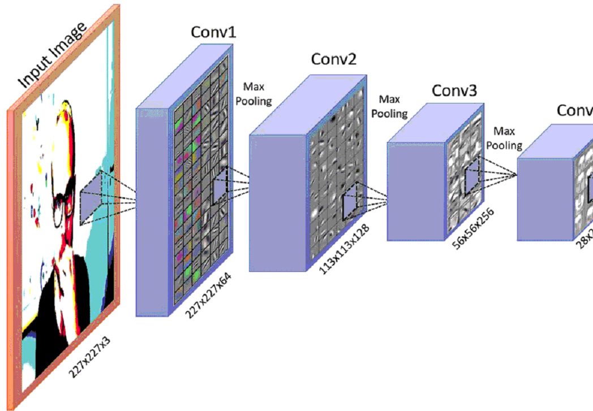

## Proposed Methods

**Project Participants:** **Ryan Baas, Elizabeth Sheetz, Josh Ohm**

**Objective**

A digital watermark is data that is embedded into various forms of media, such as digital images and videos, usually for the purpose of identifying ownership of said media and to protect it from being stolen. These watermarks are easily detected by many different digital devices, such as computers and neural networks\[1\]. In this project, we will apply multiple digital watermarks on the test set of the ImageNet dataset using *Tensorflow*. We will then analyze and compare the classification accuracies of neural network models such as VGG on the watermarked images.

**Dataset**

As stated in the objective, we will be using the ImageNet dataset for this project. ImageNet, as its name implies, is an image database that organizes images into classes according to the WordNet hierarchy, with each class containing over five hundred nodes on average\[2\]. ImageNet provides over 1.3 million images of 1000 classes for the purpose of testing machine learning and deep learning algorithms, and it is generally the most frequently used dataset for deep learning researchers. In this project, we will be using 25 different images from five different classes (five images per class).

**Network Architecture**

The VGG Neural Network Architecture will be used during this project. The name VGG is derived from the name of its designer, the [Oxford Visual Geometry Group](http://www.robots.ox.ac.uk/~vgg). The group released the white paper in 2017a \[4\].

VGG utilizes 3x3 convolution and 2x2 pooling operations . Inputs go directly to the first convolutional layers neurons, then max pooling of the the weights occurs. Max pooling is often grouped in with with the Convolution Layer it is summing. Thus we simply call this a **hidden layer**. A graphic of this can be shown in figure 1 and figure 2 below.

**Figure 1:** *An example of a 2D CNN with Max pooling* [5\] . 

**Figure 2:** *Visualization of a CNN for use in Image Recognition* \[6\].

**Table 1**

| Number Of Inputs | Hidden Layers | Filter Size, Number | Activation Function |
| ---------------- | ------------- | ------------------- | ------------------- |
| 256x256x3        | 65536         | 8x8                 | Softmax             |

`Tensorflow` will be used on a *NVIDIA JETSON TK1* Development Board.

**Training Strategy**

<u>Cost Function</u> - A "*Style*" Cost Function will be used. This was chosen due its common use by image classifiers. The "*Style*" of an image is determined based on the correlation between activations across channels. This will be implemented using [multinomial logistic regression](https://en.wikipedia.org/wiki/Multinomial_logistic_regression), or more commonly referred to as *softmax regression*. Softmax regression applies nonlinearity to the output of the network, then calculates the cross entropy between the normalized predictions and the label index. In turn it gives a decisive output from `0-1`.

<u>Initializing weights and biases</u> - Weights and biases will be implemented at *random* during the learning process. This is due to the fact the network does not need to know exactly where something is in reference to the larger image in order to detect it. These weights and biases will be *different* for each class.

<u>Batch Size</u> - 25 *Images* and 5 *Classes*.

**References**

1.  [http://digitalwatermarkingalliance.org/digital-watermarking-works/](http://digitalwatermarkingalliance.org/digital-watermarking-works/)

2.  [http://www.image-net.org/](http://www.image-net.org/)

3.  [https://www.tensorflow.org/tutorials/images/deep\_cnn](https://www.tensorflow.org/tutorials/images/deep_cnn)

4.  [http://www.robots.ox.ac.uk/\~vgg/practicals/cnn/index.html](http://www.robots.ox.ac.uk/~vgg/practicals/cnn/index.html)

5.  [http://colah.github.io/posts/2014-07-Conv-Nets-Modular/](http://colah.github.io/posts/2014-07-Conv-Nets-Modular/)

6.  [https://www.researchgate.net/publication/318798243\_Artificial\_Intelligent\_System\_for\_Automatic\_Depression\_Level\_Analysis\_through\_Visual\_and\_Vocal\_Expressions](https://www.researchgate.net/publication/318798243_Artificial_Intelligent_System_for_Automatic_Depression_Level_Analysis_through_Visual_and_Vocal_Expressions)

7.  [https://www.analyticsvidhya.com/blog/2018/12/guide-convolutional-neural-network-cnn/](https://www.analyticsvidhya.com/blog/2018/12/guide-convolutional-neural-network-cnn/)

8.  https://datascience.stackexchange.com/questions/9850/neural-networks-which-cost-function-to-use/

